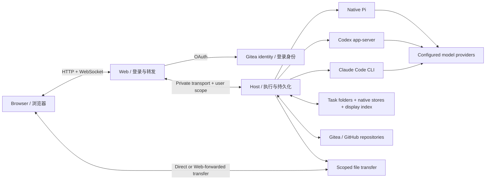

# PI Coffee Server

**把运行在自己机器上的原生 AI Agent，变成可通过浏览器使用的开发工作台。**
**A browser workbench for native AI agents running on your own machine.**

[中文说明](#中文说明) · [English guide](#english-guide) · [部署配置 / Deployment configuration](#deployment-configuration) · [文档索引 / Documentation](docs/index.md) · [插件仓库 / Plugins](https://github.com/awangs1986/pi-coffee)

PI Coffee Server owns the Browser, Web gateway, Host, optional Relay and native
Pi / Codex CLI / Claude Code adapters. Independently versioned Pi plugins live in
[`pi-coffee/packages`](https://github.com/awangs1986/pi-coffee/tree/main/packages).
GitHub is the source authority; Gitea mirrors the same commits. See
[REPOSITORIES.md](REPOSITORIES.md) for ownership and release boundaries.

## 中文说明

### 1. 项目解决什么问题

PI Coffee 让你在浏览器里管理对话和项目，由 Linux 主机或 VM 上的原生 Agent
执行读文件、改代码、运行命令和测试等工作。浏览器关闭或切到另一个对话，
不等于停止正在执行的任务。

它提供统一的操作界面，同时保留各个 Agent 的原生登录、会话 ID、工具和上下文。
Pi 的 Harness、LSP 和交接插件不会注入 Codex 或 Claude Code。

| 使用场景 | 当前行为 |
| --- | --- |
| Chat | 新对话默认使用 Pi Chat；也有独立目录，可保存附件和资料 |
| Work | 创建时选择 Pi、Codex 或 Claude Code，选择 Gitea/GitHub 项目与起始分支 |
| 项目目录 | 每个任务独立 clone；同一仓库的两个任务不会共用一个工作目录 |
| 对话导航 | 独立 URL、项目/自定义分组、新建与删除空分组、搜索、草稿恢复、前进后退和近期历史缓存 |
| 开发操作 | 文件浏览、Diff、本轮修改摘要、Checkpoint、同步和 PR 操作 |
| 输入与执行 | 根据 Agent 能力提供排队、编辑/取消排队、插话、停止和原生确认问题 |
| 附件 | 粘贴/选择后先留在草稿，点击发送才上传；支持图片预览和文件下载 |
| Skills | 从左上角菜单管理，按 Agent 和作用域安装到 Host 的原生目录 |
| Fork | 创建新任务和独立目录；原生 Fork 与实验性 Handoff 的可用性按 Agent 显示 |
| Agent 交接 | 闲置的 Work 可显式进行 Pi ↔ Codex 交接；Chat 不升级；交接可能丢失信息或发生漂移 |
| 远程协助 | 测试服务器配置与显式 `/sshme` 是两个不同用途，后者用于协助处理用户本机问题 |

不是所有 Agent 都有相同能力。界面按照当前 Adapter 的实际能力显示选项；
缺少 CLI、版本不支持或原生登录未就绪时，应显示原因，而不是偷偷切换 Agent。

### 2. 工作原理



- **Browser**：负责界面、输入草稿和有容量限制的显示缓存。缓存不负责恢复模型上下文。
- **Web**：负责 Gitea 登录、路由、授权校验和请求转发；不作为聊天正文的持久化数据库。
- **Host**：运行在拥有项目目录和原生账号的机器上，管理任务、执行进程、文件、队列和历史索引。
- **Agent Adapter**：Pi 使用原生 RPC，Codex 使用 `codex app-server`，Claude Code 使用其原生 JSON 流接口。Agent 原生记录是恢复上下文的依据。
- **显示同步**：Host 的 SQLite 索引是可重建的历史投影；浏览器通过分页、版本号和变更读取更新界面。
- **Relay（可选）**：为明确配置的模型 API 或搜索请求提供转发；原生 Codex/Claude 接入不要求经过 Pi 的 Relay。

一次切换分成三个独立过程：**本地选择 → 历史同步 → 原生连接准备**。
本地缓存和新到达的历史不应排在慢网络请求后面。旧对话的异步结果只能更新它自己的数据，
不能覆盖当前对话。索引追上版本号，也不等于原生历史已核对完成；界面区分这两种状态。
不支持只读历史格式时仍有自动原生读取回退，因此“打开页面”不保证完全不启动原生进程。

浏览器断线保留 Host 上的工作；Host 进程被停止或 VM 关机则可能中断任务。
无法确认是否送达的指令不会自动重发。详细合同见
[对话切换](docs/spec/conversation-switching.md)和[显示同步](docs/spec/local-first-conversation-sync.md)。

### 3. 身份、权限与部署拓扑

请把三类授权分开理解：

| 授权 | 用途 | 管理位置 |
| --- | --- | --- |
| Gitea OAuth 登录 | 进入 Web，选择所属 Host 和用户作用域 | Web 的私有配置 |
| 原生模型登录 | Pi、Codex、Claude 访问各自模型供应商 | Host 系统用户的原生账号/配置目录 |
| 代码托管权限 | clone、fetch、push、PR 等仓库操作 | Host 的 Gitea 配置，或 Web 绑定后保存在 Host 的 GitHub 账号 |

一个 Gitea 用户可以绑定多个 GitHub 账号，项目明确选择其中一个。
受管理的 Git/gh 操作使用任务绑定，不自动借用 VM 上其他账号的 GitHub 登录。
当前 Gitea 仓库传输仍使用 Host 配置的 Gitea 凭证；Gitea 网页登录并不自动生成每个 Agent
独立的 Gitea Git 凭证。详见 [GitHub 授权合同](docs/spec/github-accounts.md)。

Web 与 Host 可以同机，也可以分机。支持两种路由：

- **独立 Host/VM**：各 Gitea 用户配置不同的 Host 地址和令牌，适合需要系统级隔离的部署。
- **共享 Host**：Web 设置 `PI_COFFEE_SHARED_HOST=1`，Host 设置 `PI_COFFEE_REQUIRE_USER=1`，按 `gitea-<用户数字 ID>` 划分平台数据。

共享系统用户下的目录和 Web 授权属于应用层隔离，**不是 Agent 之间的操作系统沙箱**。
Host 上的 Agent 使用该系统用户的执行权限；只应给受信任的使用者访问。
VM 生命周期和权限策略由部署者管理，项目不会自动创建 VM 或为 Host 自动授予 sudo。

### 4. 数据放在哪里

启用任务总目录后，新任务采用如下结构；示例账户名不是 Gitea 登录凭证：

```text
/home/coffee/tasks/
  alice/projects/<conversation-id>/
    task.json
    history/conversation.json
    attachments/
    artifacts/
    research/
    images/
    workspace/                  # Chat 的目录 / Work 的独立 Git clone
  bob/projects/<conversation-id>/
    ...
```

`history/conversation.json` 是显示/导出快照，不是原生 Agent 的恢复文件。
还需要保留 Host 注册信息、原生 Pi/Codex/Claude 会话和账号目录、GitHub 授权记录与配置。
只备份 `tasks/` 不足以恢复整个系统。

归档保留目录；永久清理需要明确操作，且受 Agent 能力限制。
修改目录配置不会自动搬迁旧任务。不要把旧注册信息覆盖到当前数据上。
[任务存储合同](docs/spec/task-storage.md)解释了路径映射和备份范围。

<a id="local-demo"></a>
### 5. 依赖与本机体验

需要 Linux、Git、Bash、OpenSSL、curl、Node.js **≥22.19.0** 和 npm；建议使用验证过的 Node 22.23.2。
构建需要 devDependencies，不能在构建前使用 `npm ci --omit=dev`。
安装时需要访问 npm 和 GitHub Release，运行时由相应主机访问 Gitea、GitHub 及模型供应商。

Codex/Claude 是可选的独立 CLI，不由本项目的 `npm ci` 自动安装。
当前 Adapter 接受 Codex 0.154.0、0.156.1、0.159.1 和 Claude Code 2.1.280；
新增版本应先验证 Adapter。没有配置可执行路径的 Agent 不会被启用。

以下用于**新建的本机体验环境**，在未加载生产 `PI_COFFEE_*` 配置的 shell 中执行。
所有监听地址保持 loopback；这不是给局域网多人访问的部署方法。

```bash
git clone https://github.com/awangs1986/pi-coffee-server.git
cd pi-coffee-server
npm ci
npm run check

# 可选：以将来运行 Host 的同一个系统用户，进入 Pi 完成原生登录。
# Optional: authenticate native Pi as the same OS user that will run Host.
./node_modules/.bin/pi
```

退出 Pi 后启动体验环境；若 Pi 使用自定义账号目录，同时设置 `PI_COFFEE_AGENT_DIR`：

```bash
export PI_COFFEE_HOST_BIND=127.0.0.1
export PI_COFFEE_HOST_PORT=8788
export PI_COFFEE_WEB_BIND=127.0.0.1
export PI_COFFEE_WEB_PORT=3000
export PI_COFFEE_TRANSFER_BIND=127.0.0.1
export PI_COFFEE_TRANSFER_ADVERTISE=127.0.0.1
export PI_COFFEE_TRANSFER_PORT=53317
export PI_COFFEE_HOST_TOKEN="$(openssl rand -hex 32)"
export PI_COFFEE_DEFAULT_USER=demo
export PI_COFFEE_REQUIRE_USER=1
export PI_COFFEE_WORKDIR="$HOME/.local/share/pi-coffee-demo/work"
export PI_COFFEE_SESSION_DIR="$HOME/.local/share/pi-coffee-demo/sessions"
export PI_COFFEE_TASK_ROOT="$HOME/.local/share/pi-coffee-demo/tasks"
export PI_COFFEE_TASK_DEFAULT_USER=system
export PI_COFFEE_TMP_ROOT="$HOME/.cache/pi-coffee-demo/tmp"
npm start
```

打开 <http://127.0.0.1:3000>。`npm run check` 已包含构建；如果跳过检查，先运行
`npm run build`。界面可以启动不代表模型账号已可用，实际对话还需要原生登录和可用模型。
`npm start` 使用 `all` 角色；没有配置 Relay 相关密钥时启动 Host、Web 和文件传输。

### 6. 长期部署步骤

1. 在 Web 和 Host 机器上安装同一 Git 提交：`npm ci`，然后 `npm run check`。建议放到 `/opt/pi-coffee-server/releases/<commit>`，保留旧目录。
2. 准备 Host 系统用户及其 HOME、项目空间和原生账号。在该用户下登录需要的 Agent，确认 CLI 版本和网络可用。
3. 在 Gitea 创建 OAuth 应用，回调地址设为 `<PI_COFFEE_PUBLIC_URL>/auth/callback`。查询允许登录用户的**数字 ID**，按下方 `routes.json` 配置。
4. 分别填写 [Host 环境文件](#host-env)、[Web 环境文件](#web-env)和[路由文件](#routes-json)。令牌使用 `openssl rand -hex 32` 生成，保存在 Git 目录外。
5. 按 [systemd 示例](#systemd-units)配置两个进程，先启动 Host 并验证健康，再启动 Web。Web 与 Host 同机时也可保持两个独立进程。
6. 用实际 `PI_COFFEE_PUBLIC_URL` 登录，完成 [验收](#verification)。不要混用多个域名/IP，否则 OAuth Cookie、回调和 Origin 检查可能不匹配。

下面给出**共享 Host、两个平台账户**的完整配置骨架。示例采用系统用户 `coffee`、
账户 ID `101/102` 和占位地址；全部替换为自己的环境。独立 VM 部署的调整方式也列在后面。

### 7. 版本、维护与排错

- 版本依据是 [`package.json`](package.json) 和 [`package-lock.json`](package-lock.json)，不是某台机器全局安装的 `pi`。Pi 插件有独立版本，升级插件仓库不等于 Server 已消费新版。
- 当前依赖见[版本表](#pinned-versions)。Host 自动组合锁定的插件，不需要再次全局安装同名插件。不要在已发布目录中执行 `npm update`，也不要覆盖不可变的插件发布包。
- 升级先构建新目录、检查原生兼容和页面资源，再等待所有运行任务、排队消息及后台写入结束。部署对话本身也算运行任务。
- 回滚首先回到保留的程序与配置；原生数据格式变化不能靠降级可执行文件自动撤销。不要用旧注册文件覆盖新任务。
- 可安装[有限重启 watchdog](docs/deployment/watchdog.md)。它只检查本机进程和健康响应，有重试上限；它不能判断模型回答是否正确，也不会替用户自动续发指令。

常见问题与英文指南后面的[排错表](#troubleshooting)共用。更多维护细节见
[统一发布流程](docs/deployment/unified-release.md)。本 README 的配置说明以当前入口
`src/main.ts` 为准；`deploy/` 中保留的历史模板需要按角色、路径和当前授权策略调整，不能原样覆盖现有配置。

## English guide

### 1. What this project does

PI Coffee turns native agents on a Linux machine or VM into a browser development
workbench. Users manage conversations, repositories, files and execution from the
browser; the Host owns the processes and durable task data. Closing a browser or
selecting another conversation does not cancel a running task.

The interface is shared, while each engine retains its native login, session IDs,
tools and model context. Pi-specific Harness, LSP and Handoff packages are not
injected into Codex or Claude Code.

| Capability | Current behavior |
| --- | --- |
| Chat | Defaults to Pi Chat, with its own directory for attachments and other task data |
| Work | Select Pi, Codex or Claude, a Gitea/GitHub repository and a starting branch |
| Checkouts | One independent clone per task; conversations do not share a writable checkout |
| Navigation | Canonical conversation URLs, project/custom groups, creation and empty-only group deletion, search, drafts, Back/Forward and bounded recent-history caches |
| Development | File browsing, Diff, latest-turn edits, Checkpoint, synchronization and PR operations |
| Execution | Queues, queue editing/cancellation, steering, stop and native questions according to engine capabilities |
| Attachments | Stay in the browser draft until Send; image previews and scoped downloads are supported |
| Skills | Managed in the logo menu, installed into the selected engine's native roots on Host |
| Fork | Creates a new conversation and independent directory; native and experimental Handoff modes depend on the engine |
| Takeover | Idle Work tasks can explicitly switch Pi ↔ Codex through experimental handoff; Chat cannot upgrade |
| Remote assistance | Configured test runners and explicitly invoked `/sshme` serve different purposes |

Engine capabilities are intentionally not identical. Missing executables,
unsupported versions and unavailable native authentication produce visible
reasons, not an automatic switch to another engine.

### 2. Architecture and conversation lifecycle

The architecture diagram above shows the main data flow:

- **Browser** owns presentation, drafts and disposable bounded caches.
- **Web** owns login, authenticated routing and forwarding, not durable transcript storage.
- **Host** owns tasks, native processes, files, queues, scoped accounts and the derived display index.
- **Agent adapters** use native Pi RPC, Codex's `app-server` and Claude Code's JSON stream interface. Native transcripts remain authoritative for resuming model context.
- **Display synchronization** uses a rebuildable SQLite index, bounded pages, revisions and changes. Browser caches are not native session recovery files.
- **Optional Relay** forwards explicitly configured model-API/search traffic. Native Codex/Claude integration does not require Pi's Relay.

Selection, history synchronization and native attachment have separate lifetimes.
The browser first selects the destination locally, displays available data, then
updates history while native execution readiness is established independently.
Late results from another selection cannot replace the selected conversation.
Catching up with an index revision is distinct from verifying the native source.
Unsupported read-only history formats retain automatic native-history fallback,
so browsing is not a promise that no native process will start.

A browser disconnect preserves work on Host. Stopping Host or the VM can interrupt
it. An instruction with uncertain delivery is not automatically replayed. See
[conversation switching](docs/spec/conversation-switching.md) and
[display synchronization](docs/spec/local-first-conversation-sync.md).

### 3. Accounts, isolation and storage

There are three independent authorization layers:

| Layer | Purpose | Location |
| --- | --- | --- |
| Gitea OAuth identity | Web login and selection of the user's Host/scope | Private Web configuration |
| Native model authentication | Pi/Codex/Claude access to configured model providers | Host user's native stores/configuration |
| Repository authorization | Clone, fetch, push and PR operations | Host Gitea configuration or explicitly connected GitHub accounts |

One Gitea user can connect several GitHub accounts. Each project chooses an
account; managed Git/gh operations do not borrow an unrelated VM GitHub login.
Gitea transport currently uses the configured Host credential, not an automatic
per-agent Git credential derived from Web login. Details:
[GitHub authorization](docs/spec/github-accounts.md).

Web and Host can run on separate machines or on the same machine. Dedicated
Host/VM routing uses a distinct address and token per Gitea user. Shared routing
requires `PI_COFFEE_SHARED_HOST=1` on Web and `PI_COFFEE_REQUIRE_USER=1` on Host;
the forwarded scope is `gitea-<numeric-user-id>`.

A shared OS user provides application-level separation, **not an OS sandbox
between agents**. Agents execute with that user's permissions. Use trusted users
or separate Host/VM instances when OS isolation is required. VM creation,
snapshots and any sudo policy remain administrator decisions.

With task storage enabled, each account gets
`<TASK_ROOT>/<account>/projects/<conversation-id>/`. The tree shown in the Chinese
guide is engine-neutral: Chat has an ordinary `workspace/`; Work has an independent
Git clone there. Attachments and exported history are outside the checkout.
`history/conversation.json` is a display/export snapshot, not a native resume file.

Back up task bundles **and** the Host registry, native session/account stores,
GitHub authorization records and private configuration. Archiving retains data;
permanent cleanup is explicit and engine-dependent. Changing a root setting does
not relocate existing tasks. See [task storage](docs/spec/task-storage.md).

### 4. Requirements and local evaluation

Use Linux, Git, Bash, OpenSSL, curl, npm and Node.js **≥22.19.0**; Node 22.23.2 is a validated
choice. Build dependencies are required: do not use `npm ci --omit=dev` before
building. Installation accesses npm and GitHub Releases. Web needs access to its
identity/code-hosting endpoints; Host needs repository and model-provider access.

Codex and Claude are optional separate CLI installations. The current Adapter
accepts Codex 0.154.0, 0.156.1 and 0.159.1, and Claude Code 2.1.280. Other versions
require compatibility validation. The paths are configured explicitly; `npm ci`
does not install those CLIs or authenticate them.

For a new local evaluation, clone this repository and run `npm ci` followed by
`npm run check`. The latter includes the build. Authenticate Pi using
`./node_modules/.bin/pi` as the intended Host OS user, then exit the interactive
CLI. A custom Pi account directory must also be supplied as `PI_COFFEE_AGENT_DIR`.

Use the exact loopback-only environment block in [本机体验](#local-demo), then
run `npm start` and open <http://127.0.0.1:3000>. Start in a shell without production
`PI_COFFEE_*` configuration. This setup deliberately has no Web OAuth and is not
a LAN deployment. Loading the page does not prove that a model login is ready.

`npm start` runs the `all` role: Host, Web and file transfer, plus Relay only when
its relevant credentials are configured. Separate roles are:

```bash
node dist/src/main.js host
node dist/src/main.js web
node dist/src/main.js relay
```

### 5. Authenticated deployment

1. Install the same Git commit on Web and Host with `npm ci && npm run check`. Prefer immutable `/opt/pi-coffee-server/releases/<commit>` directories and retain the previous release.
2. Prepare the Host OS user, HOME, writable data roots and native model logins. Verify CLI versions as that user, not only as root.
3. Register a Gitea OAuth application with callback `<PI_COFFEE_PUBLIC_URL>/auth/callback`. Obtain each allowed user's **numeric ID** for `routes.json`.
4. Fill in the shared [Host](#host-env), [Web](#web-env) and [route](#routes-json) examples below. Generate private tokens with `openssl rand -hex 32`; keep these files outside Git.
5. Install the explicit-role [systemd units](#systemd-units). Start Host, verify its health, then start Web. Separate processes remain useful even on one machine.
6. Sign in using the configured canonical public URL and follow [verification](#verification). Mixing hostnames/IPs can break cookies, OAuth callbacks and Origin checks.

The following examples form one shared Host with two platform accounts. Replace
all example IDs, paths, hostnames and secrets. Dedicated-VM adjustments are
provided after the route example.

### 6. Upgrades and recovery

The checked-in manifest/lockfile determine consumed Pi/plugin versions; a global
`pi` executable or a newer plugin repository commit does not determine this
Server's dependencies. Host composes its pinned plugins automatically; a second
global installation of those plugins is unnecessary. Use the [version table](#pinned-versions). Do not run
`npm update` inside a published release or replace immutable release assets.

Build and verify a new release before activation. Wait for all active turns,
queued input, background writers and workspace operations, including work in the
deployment conversation. Preserve previous code/configuration and native data.
Rollback of executable files does not undo a native data-format migration; never
replace a current task registry with an older copy merely to change code versions.

The optional [bounded watchdog](docs/deployment/watchdog.md) checks local process
and HTTP health with finite retries. It does not verify model replies or resend
instructions. Pause it for planned maintenance and resume after independent
verification. Follow the [release runbook](docs/deployment/unified-release.md).

These instructions follow the current `src/main.ts` entrypoint. Historical files
under `deploy/` need role/path/authentication adjustments; do not copy them over
an existing installation without reconciling those settings.

<a id="deployment-configuration"></a>
## Deployment configuration / 部署配置

The blocks below are shared by both language guides. Environment files use
`KEY=value`, without `export`. Use absolute paths: systemd and Node env files do
not expand `$HOME` inside values. Keep files mode `0600` and readable by the
appropriate process owner. / 以下配置供两种语言共用，使用绝对路径，不写 `export`，
不依赖 `$HOME` 展开；文件放在仓库外，权限 `0600`，由相应进程的用户持有。

<a id="host-env"></a>
### Host: `/etc/pi-coffee/host.env`

```ini
# Replace coffee and HOST_PRIVATE_IP. / 替换系统用户名和 Host 私网地址。
PI_COFFEE_HOST_BIND=HOST_PRIVATE_IP
PI_COFFEE_HOST_PORT=8788
PI_COFFEE_HOST_TOKEN=REPLACE_WITH_RANDOM_HOST_TOKEN
PI_COFFEE_REQUIRE_USER=1

# Registry/native bookkeeping and task bundles are separate. / 注册信息与任务目录分开。
PI_COFFEE_WORKDIR=/home/coffee/state/work
PI_COFFEE_SESSION_DIR=/home/coffee/state/sessions
PI_COFFEE_TASK_ROOT=/home/coffee/tasks
PI_COFFEE_TASK_DEFAULT_USER=system
PI_COFFEE_TASK_USER_MAP='{"gitea-101":"alice","gitea-102":"bob"}'
PI_COFFEE_TMP_ROOT=/home/coffee/.cache/pi-coffee/runtime-tmp

# Use the same Pi directory used for native login. / 与原生 Pi 登录目录一致。
PI_COFFEE_AGENT_DIR=/home/coffee/.pi/agent

# Gitea repository operations; separate from the OAuth application. / 仓库操作凭证。
PI_COFFEE_GITEA_URL=http://GITEA_HOST:3000
PI_COFFEE_GITEA_OWNER=REPLACE_WITH_REPOSITORY_OWNER
PI_COFFEE_GITEA_TOKEN=REPLACE_WITH_REPOSITORY_ACCESS_TOKEN

# Transfer address must be reachable by Web; direct clients may also use it.
# 文件传输地址必须能被 Web 访问；浏览器也可能直接使用。
PI_COFFEE_TRANSFER_BIND=HOST_PRIVATE_IP
PI_COFFEE_TRANSFER_ADVERTISE=HOST_PRIVATE_IP
PI_COFFEE_TRANSFER_PORT=53317

# Optional native agents: executable paths, not shell command strings.
# 可选 Agent：只填可执行路径，不填带参数的 shell 命令。
# PI_COFFEE_CODEX_COMMAND=/home/coffee/.local/bin/codex
# PI_COFFEE_CODEX_HOME=/home/coffee/.codex
# PI_COFFEE_CODEX_EFFORT=medium
# PI_COFFEE_CLAUDE_COMMAND=/home/coffee/.local/bin/claude

# Only this authenticated scope may manage machine-wide Skills.
# 仅此身份可管理机器级 Skills；其他身份使用允许的项目作用域。
PI_COFFEE_SKILL_OWNER=gitea-101
```

Create the data directories as the Host OS user. The default account `system`
must be distinct from every scoped account mapping; mappings must be unique.
Existing tasks retain registered paths. / 以 Host 用户创建这些目录；默认账户目录
`system` 不得与任何用户映射重复，已有任务继续使用原注册路径。

Optional Pi model policy / 可选 Pi 模型限制：

```ini
# Fill actual native provider/model IDs before enabling. / 启用前填真实原生 ID。
# PI_COFFEE_PROVIDER=provider-id
# PI_COFFEE_MODEL=model-id
# PI_COFFEE_PI_ALLOWED_MODELS=provider-id/model-id,another-provider/another-model
```

An allowlist filters Host-managed Pi choices; it does not configure provider
credentials or restrict native Codex/Claude model catalogs. A missing or disallowed
model does not silently become another one. / 白名单只限制 Host 管理的 Pi 模型选择，
不负责供应商登录，也不改变 Codex/Claude 原生目录。

<a id="web-env"></a>
### Web: `/etc/pi-coffee/web.env`

```ini
PI_COFFEE_WEB_BIND=0.0.0.0
PI_COFFEE_WEB_PORT=3000
PI_COFFEE_PUBLIC_URL=http://WEB_HOST:3000

PI_COFFEE_GITEA_URL=http://GITEA_HOST:3000
PI_COFFEE_GITEA_CLIENT_ID=REPLACE_WITH_GITEA_OAUTH_CLIENT_ID
PI_COFFEE_GITEA_CLIENT_SECRET=REPLACE_WITH_GITEA_OAUTH_CLIENT_SECRET
PI_COFFEE_ROUTES_FILE=/etc/pi-coffee/routes.json
PI_COFFEE_SHARED_HOST=1

# Optional GitHub OAuth App, not the Gitea OAuth App. / 可选的独立 GitHub OAuth 应用。
# PI_COFFEE_GITHUB_CLIENT_ID=REPLACE_WITH_GITHUB_OAUTH_CLIENT_ID
# PI_COFFEE_GITHUB_CLIENT_SECRET=REPLACE_WITH_GITHUB_OAUTH_CLIENT_SECRET
```

Gitea callback: `http://WEB_HOST:3000/auth/callback`.
GitHub callback: `http://WEB_HOST:3000/auth/github/callback`.

Use your actual canonical origin for both. Web binds on all interfaces only with
identity configured; keep unauthenticated demo mode out of a shared deployment.
For HTTPS, preserve WebSocket upgrades and the external Origin. Native Web TLS
uses `PI_COFFEE_WEB_TLS_CERT` / `PI_COFFEE_WEB_TLS_KEY`.

两种 OAuth 应用使用不同回调，且必须与实际访问地址一致。共享部署不要启用无认证体验模式。
HTTPS 部署需正确转发 WebSocket 并保留外部 Origin；Web 也支持上面两个 TLS 文件变量。

<a id="routes-json"></a>
### Routes: `/etc/pi-coffee/routes.json`

```json
{
  "101": {
    "hostUrl": "ws://HOST_PRIVATE_IP:8788/host",
    "hostToken": "REPLACE_WITH_RANDOM_HOST_TOKEN"
  },
  "102": {
    "hostUrl": "ws://HOST_PRIVATE_IP:8788/host",
    "hostToken": "REPLACE_WITH_RANDOM_HOST_TOKEN"
  }
}
```

The keys are real Gitea numeric user IDs, not login names. In shared mode Web
forwards `gitea-101` / `gitea-102`; use exactly these scopes in the Host task map
and Skill-owner setting. Each token must equal the target Host's configured token.
Web must be able to resolve and reach every `hostUrl`.

这里的 key 是真实 Gitea 数字 ID。共享模式会生成 `gitea-101` / `gitea-102`，
必须与 Host 的目录映射、Skills 管理身份一致；令牌必须与目标 Host 相同。

**Dedicated Hosts / 独立 Host：** omit `PI_COFFEE_SHARED_HOST` or set it to `0`;
use a distinct URL and token for every route. Each dedicated Host uses its default
scope (`PI_COFFEE_REQUIRE_USER=0`) and its own `PI_COFFEE_TASK_DEFAULT_USER`.
Do not flip an existing installation's routing mode without planning data/scope
migration. / 每个用户填写不同的地址和令牌，独立 Host 使用默认作用域与各自的默认任务账户；
切换既有路由模式需要处理数据作用域迁移。

The older allowed-login configuration (`PI_COFFEE_ALLOWED_USERS`, without a route
file) remains supported. It uses login-name scopes instead of numeric-ID scopes.
Do not mix these mappings. / 旧的登录名白名单模式仍支持，但作用域格式不同，不要混用。

<a id="systemd-units"></a>
### Explicit-role systemd units / 显式角色的 systemd 配置

These are templates for a **new installation**. Replace the OS user, HOME, Node
path and release directory. Confirm `node --version` for the exact executable
used by systemd; interactive shell setup is not automatically loaded. If Node is
installed outside the listed directories, add its directory to the unit PATH too.
The service user must be able to read/execute the release and write its data roots.

以下模板用于新安装。替换用户名、HOME、Node 路径和发布目录；systemd 不会自动读取交互
shell 的 Node 环境。自定义 Node 目录也需加入 unit 的 PATH；服务用户必须能读取/执行发布文件、
写入自己的数据目录。既有安装请备份后修改，不要盲目覆盖。

`/etc/systemd/system/pi-coffee-host.service`:

```ini
[Unit]
Description=PI Coffee Host
After=network-online.target
Wants=network-online.target
StartLimitIntervalSec=1800
StartLimitBurst=3

[Service]
Type=exec
User=coffee
Group=coffee
WorkingDirectory=/opt/pi-coffee-server/releases/REPLACE_WITH_COMMIT
EnvironmentFile=/etc/pi-coffee/host.env
Environment=HOME=/home/coffee
Environment=PATH=/usr/local/bin:/usr/bin:/bin:/home/coffee/.local/bin
ExecStart=/usr/bin/node dist/src/main.js host
Restart=on-failure
RestartSec=10
TimeoutStopSec=300

[Install]
WantedBy=multi-user.target
```

`/etc/systemd/system/pi-coffee-web.service`:

```ini
[Unit]
Description=PI Coffee Web
After=network-online.target
Wants=network-online.target
StartLimitIntervalSec=1800
StartLimitBurst=3

[Service]
Type=exec
User=coffee
Group=coffee
WorkingDirectory=/opt/pi-coffee-server/releases/REPLACE_WITH_COMMIT
EnvironmentFile=/etc/pi-coffee/web.env
Environment=HOME=/home/coffee
Environment=PATH=/usr/local/bin:/usr/bin:/bin
ExecStart=/usr/bin/node dist/src/main.js web
Restart=on-failure
RestartSec=10
TimeoutStopSec=300
NoNewPrivileges=true

[Install]
WantedBy=multi-user.target
```

Web can use a separate low-privilege OS user; it does not need native model login
or project-directory access. Make its environment/routes files readable to that
user. Host runs as the owner of native accounts and working directories.

Web 可使用单独的低权限系统用户，只需能读取它的配置和路由，无需读取原生模型账号或项目文件；
Host 则应使用原生账号和工作目录的拥有者。

After installing the files on the appropriate machines / 在对应机器安装好文件后：

```bash
sudo systemctl daemon-reload
# On Host / 在 Host 机器上
sudo systemctl enable --now pi-coffee-host.service
curl --fail http://HOST_PRIVATE_IP:8788/healthz

# On Web, after Host is ready / Host 就绪后在 Web 机器上
sudo systemctl enable --now pi-coffee-web.service
curl --fail http://127.0.0.1:3000/healthz
```

| Default port / 默认端口 | Purpose / 用途 | Reachability / 访问范围 |
| --- | --- | --- |
| 3000 | Browser HTTP/WebSocket / 浏览器入口 | Intended clients / 目标客户端 |
| 8788 | Host HTTP/WebSocket / Host 私有入口 | Web and administration / Web 与管理端 |
| 53317 | Scoped file transfer / 文件传输 | Web; clients if using direct transfer / Web，直接传输时也需客户端可达 |
| 8789 | Optional Relay / 可选转发 | Configured internal callers / 已配置的内部调用方 |

Web can stream scoped file transfers when direct browser-to-Host transfer is
unavailable. It still needs to reach the advertised transfer address. HTTP transfer
behind an HTTPS page may require this same-origin path, or matching transfer TLS
(`PI_COFFEE_TRANSFER_TLS_CERT` / `PI_COFFEE_TRANSFER_TLS_KEY`). Setting
`PI_COFFEE_TRANSFER_BIND=off` disables that capability.

浏览器不能直达 Host 时可经 Web 转发文件，但 Web 必须能访问公布的传输地址。
HTTPS 页面需要同源转发或配套的文件传输 TLS。禁用 Transfer 后，相关附件能力也会不可用。

### Connect GitHub and manage Skills / GitHub 与 Skills

After configuring the optional GitHub OAuth App, sign into Coffee with Gitea and
use the logo menu → **代码托管账号** to connect the desired GitHub account(s).
Select an account in the repository picker. Bind older unbound projects only when
their tasks are idle. This is separate from native model authentication. Install the official `gh` CLI
on Host if agents need GitHub CLI commands; use Coffee account binding for managed
credentials rather than a shared `gh auth login`.

配置好可选 GitHub OAuth 应用后，先用 Gitea 登录，再从左上角菜单连接 GitHub 账号，
在仓库选择器里明确选择账号。旧项目在任务闲置时绑定，不需要改变模型登录。Agent 若需要 `gh` 命令，在 Host 安装官方
GitHub CLI，凭证仍通过 Coffee 绑定，不用共享的 `gh auth login`。

The **Skills** menu manages files on Host, not a Web-side execution environment.
Install for an explicit engine and user/project scope. Machine-wide changes in a
shared Host are restricted to `PI_COFFEE_SKILL_OWNER`; native discovery and restart/
reload behavior remain engine-specific. Pi and Codex have their own invocation
syntax. See [Skill management](docs/spec/skill-management.md).

Skills 由 Web 管理界面操作、Host 落盘，按 Agent 和作用域安装，不会把同一份 Pi 指令
自动注入所有 Agent。共享 Host 的机器级管理受 `PI_COFFEE_SKILL_OWNER` 限制；原生加载、
重载与调用语法按对应引擎处理。

### Optional Relay / 可选 Relay

A separate `relay` process can use `PI_COFFEE_RELAY_BIND`, `PI_COFFEE_RELAY_PORT`,
`PI_COFFEE_UPSTREAM_URL`, `PI_COFFEE_UPSTREAM_KEY` and comma-separated
`PI_COFFEE_RELAY_TOKENS`. Serper search uses `PI_COFFEE_SERPER_KEY` when configured.
Keep those credentials in the Relay's private environment, explicitly configure
the calling provider, and keep this internal endpoint private. Do not assume a
Relay is required for native Codex/Claude login. See [Relay implementation](src/relay).

Relay 是可选进程，只对明确配置的调用生效；模型和搜索上游凭证保存在其私有环境中，
不是 Web 用户登录，也不是原生 Codex/Claude 登录的替代品。不要沿用旧示例中的上游地址。

<a id="verification"></a>
## Verification / 部署验收

A green health response proves reachability, not a successful model turn or the
correct frontend release. / 健康响应只证明可达，不能替代模型和页面验收。

1. Check `/healthz` on both processes and their actual systemd `WorkingDirectory` / 核对健康状态和真实发布目录。
2. Sign in through Gitea; verify the intended Host, user scope and permitted projects / 验证登录、路由和项目权限。
3. Check the Agent/model menu; `/api/engines` requires authenticated access / 确认原生 Agent 和模型可用。
4. Create a disposable Chat and Work task, verify paths, then perform one small native request / 用临时任务验证目录和一轮原生请求。
5. Keep A running while reading B, test direct URL, Back/Forward and newest history visibility / 验证繁忙切换、链接、草稿与最新历史。
6. Upload/download one file, compare bytes, inspect Diff, and archive/restore / 验证附件、差异与归档恢复。
7. For GitHub, verify the selected account and a disposable branch/PR / 验证任务绑定的代码托管账号。

Run the release asset probe on the Web machine using its actual release directory:
/ 在 Web 机器上对实际发布目录执行资源核验：

```bash
node scripts/probe-workbench-release.mjs \
  http://127.0.0.1:3000 \
  /opt/pi-coffee-server/releases/REPLACE_WITH_COMMIT
```

Developer regression commands / 开发回归命令：

```bash
npm run check

# Requires a separately installed Playwright Chromium executable.
# 需另行安装 Playwright Chromium；自定义位置用 CHROMIUM_PATH 指定。
node scripts/probe-independent-navigation.mjs
node scripts/probe-latest-history-switch.mjs
```

These browser probes use synthetic data/native protocol fixtures. They do not
establish paid-provider availability or production latency guarantees.
/ 浏览器回归使用合成数据和原生协议测试进程，不代表真实付费供应商可用性或线上延迟保证。

For planned restarts, wait for active/queued/background work and pause any installed
watchdog first. Native automatic compaction remains native; manual Handoff is
experimental and can drift. Emergency startup can keep Host reachable with a
reduced Pi plugin set; check runtime status rather than treating `/healthz` alone
as proof that all plugins loaded.

计划重启前等待运行、排队和后台任务结束，并暂停已安装的 watchdog。
自动压缩仍由原生 Agent 处理，手动交接压缩仍属实验功能。应急模式可能让 Host 在减少
Pi 插件的情况下保持可达，因此还应核对运行模式和插件状态。

<a id="troubleshooting"></a>
## Troubleshooting / 常见问题

| Symptom / 现象 | Check / 检查 |
| --- | --- |
| `dist/src/main.js` missing / 找不到启动文件 | Run `npm run build`; installing dependencies alone does not build the app / 先构建 |
| Node works in shell but not systemd / 交互终端能运行，服务不能 | Verify `ExecStart`, Node version, PATH, HOME and file ownership / 核对服务的真实运行环境 |
| OAuth returns to an error / OAuth 回调异常 | Match public origin/callback, numeric route ID, DNS and Web access to Gitea/GitHub / 核对地址、ID 与网络 |
| Native engine unavailable / Agent 不可选 | Configure its absolute executable path, supported version and login under the Host user / 检查原生路径、版本和登录 |
| Duplicate Pi tool or missing LSP / 工具冲突或找不到 LSP | Restore lockfile-installed artifacts; inspect extension overrides; avoid duplicate plugin registrations / 核对锁定包与扩展配置 |
| Chat works, Work clone fails / 聊天可用但克隆失败 | Check Host Git, forge credential and selected repository/account permissions / 检查 Git 与仓库授权 |
| Files fail to transfer / 文件传输失败 | Verify advertised Transfer address from Web, scoped grant and HTTP/HTTPS path / 检查传输地址、授权与协议 |
| History looks old / 历史不是最新 | Distinguish cached/indexed/native verification status; retry sync and verify the actual served release / 核对同步状态和服务版本 |
| A shared user cannot manage global Skills / 无法修改机器级 Skills | Confirm `PI_COFFEE_SKILL_OWNER` or choose project scope / 检查管理身份或项目作用域 |
| Host restart did not apply / 重启后版本没变 | Inspect systemd drop-ins, `WorkingDirectory`, health and asset probe; check watchdog state / 核对覆盖配置与运行目录 |

```bash
systemctl show pi-coffee-host.service -p WorkingDirectory -p ExecStart -p MainPID
systemctl show pi-coffee-web.service -p WorkingDirectory -p ExecStart -p MainPID
journalctl -u pi-coffee-host.service -n 100 --no-pager
journalctl -u pi-coffee-web.service -n 100 --no-pager
```

Use `systemctl --user` / `journalctl --user` if you intentionally installed user
units. Inspect logs privately and remove credentials/transcripts before sharing.
/ 使用用户级 unit 时加 `--user`；日志可能含敏感运行信息，分享前脱敏。

<a id="pinned-versions"></a>
## Pinned versions / 当前锁定版本

This table describes source dependencies, **not the version currently running on
any particular server**. The lockfile remains authoritative.
/ 此表表示源码依赖，不代表任何现有服务器已经完成部署，以锁文件为准。

| Package / 包 | Version / 版本 |
| --- | --- |
| Pi coding-agent / agent-core / ai / tui | 1.0.2 |
| Coffee Harness | 0.3.1 |
| Coffee LSP | 0.4.6 |
| Context Handoff | 0.2.0-experimental.5 |
| Official pi-subagents | 0.75.0 |
| Official pi-web-access | 0.35.0 |
| Optional pi-antigravity | 0.9.0 |

## More documentation / 延伸阅读

- [Repository ownership / 仓库归属](REPOSITORIES.md)
- [Documentation map / 文档索引](docs/index.md)
- [Release, emergency startup and rollback / 发布与恢复](docs/deployment/unified-release.md)
- [Pi 1.0.2 integration / Pi 升级验收](docs/deployment/pi-102-upgrade.md)
- [Task storage and backups / 任务目录与备份](docs/spec/task-storage.md)
- [GitHub account binding / GitHub 多账号绑定](docs/spec/github-accounts.md)
- [Skills / 技能管理](docs/spec/skill-management.md)
- [Agent takeover / Agent 交接](docs/spec/agent-takeover.md)
- [Conversation Fork / 对话分叉](docs/spec/conversation-fork.md)
- [Test runners / 测试服务器](docs/spec/test-runners.md)
- [SSHME / 用户本机协助](docs/spec/sshme.md)
- [Watchdog / 有限自动恢复](docs/deployment/watchdog.md)
- [Pi plugin releases / 独立插件发布](https://github.com/awangs1986/pi-coffee/blob/main/docs/releases/README.md)

Before contributing, read [AGENTS.md](AGENTS.md). Keep secrets and user transcripts
out of Git and Issues, preserve native Agent boundaries, and publish GitHub first
before mirroring Gitea to the identical commit.
